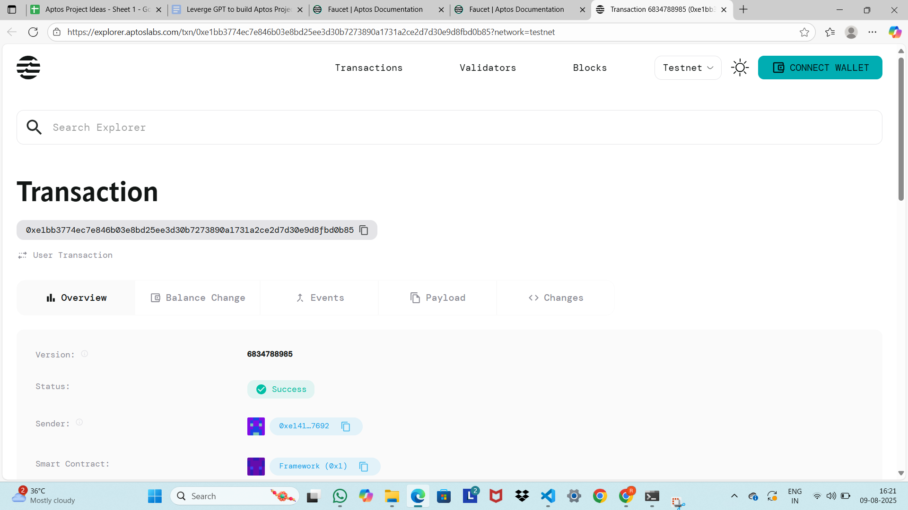

# Vault Strategy Manager

## Project Description

The Vault Strategy Manager is an innovative smart contract built on the Aptos blockchain that enables automated yield optimization strategies. This decentralized finance (DeFi) solution allows users to deposit their tokens into yield-generating vaults that automatically optimize returns through strategic asset management and compound interest mechanisms.

The smart contract implements a secure and transparent system where users can participate in yield farming without the complexity of managing multiple protocols manually. By pooling resources and utilizing automated strategies, participants can benefit from higher yields while minimizing individual risk and gas costs.

## Project Vision

Our vision is to democratize access to sophisticated yield optimization strategies that were previously available only to institutional investors and DeFi experts. We aim to create a seamless, user-friendly platform that:

- **Simplifies DeFi participation** by abstracting complex yield farming strategies into simple deposit/withdraw operations
- **Maximizes returns** through automated optimization algorithms that continuously seek the best yield opportunities
- **Reduces barriers to entry** by allowing smaller investors to benefit from pooled resources and economies of scale
- **Promotes financial inclusion** by providing equal access to advanced yield generation strategies regardless of technical expertise
- **Ensures transparency and security** through blockchain-based smart contracts that are auditable and immutable

## Key Features

### 🔐 **Secure Vault Management**
- Multi-layered security architecture with time-locked withdrawals
- Transparent smart contract operations on Aptos blockchain
- Automated risk assessment and mitigation protocols

### 📈 **Automated Yield Optimization**
- Dynamic yield rate adjustments based on market conditions
- Compound interest calculations for maximum returns
- Real-time performance tracking and analytics

### 💰 **Flexible Deposit System**
- Configurable minimum deposit requirements
- Support for multiple token types through Aptos Coin framework
- Instant deposit confirmation and yield accrual

### 🎛️ **Strategy Controls**
- Owner-managed activation/deactivation of strategies
- Customizable yield rates and parameters
- Emergency pause mechanisms for security

### 📊 **User Portfolio Tracking**
- Individual deposit history and timestamps
- Earned yield calculations and projections
- Performance metrics and ROI analysis

### ⚡ **Gas Optimization**
- Efficient Move language implementation
- Batch processing capabilities for multiple operations
- Minimal transaction costs for users

## Future Scope

### Phase 1: Enhanced Strategy Options
- **Multi-Asset Vaults**: Support for diverse cryptocurrency portfolios
- **Risk-Tiered Strategies**: Different vault options based on risk tolerance
- **Cross-Protocol Integration**: Automated yield farming across multiple DeFi protocols

### Phase 2: Advanced Features
- **Governance Token**: Community-driven decision making for strategy optimization
- **Insurance Integration**: Protection against smart contract risks and market volatility
- **Mobile Application**: User-friendly mobile interface for vault management

### Phase 3: Institutional Features
- **Institutional Vaults**: Large-scale investment options with custom terms
- **API Integration**: Developer-friendly APIs for third-party integrations
- **Advanced Analytics**: Comprehensive reporting and performance analysis tools

### Phase 4: Cross-Chain Expansion
- **Multi-Chain Support**: Expansion to other blockchain networks
- **Bridge Integration**: Seamless asset transfers between different chains
- **Unified Dashboard**: Single interface for managing cross-chain investments

### Long-term Vision
- **AI-Powered Optimization**: Machine learning algorithms for predictive yield optimization
- **Regulatory Compliance**: Full compliance with evolving DeFi regulations
- **Global Accessibility**: Multi-language support and regional customization

## Contract Details

0xe1bb3774ec7e846b03e8bd25ee3d30b7273890a1731a2ce2d7d30e9d8fbd0b85

